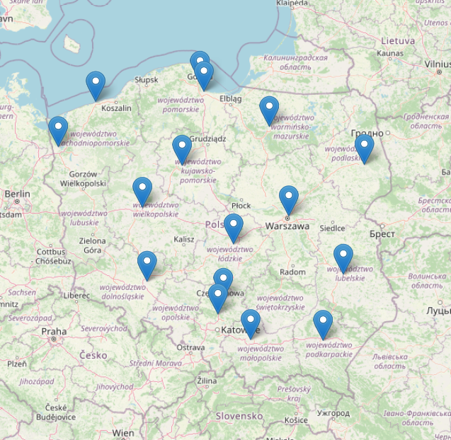

```{r setup, include=FALSE}
knitr::opts_chunk$set(echo = FALSE,
                      error = FALSE,
                      warning = FALSE,
                      message = FALSE)
library("tidyverse")
library("reticulate")
library("kableExtra")
library("leaflet")
setwd("C:/Users/wpiel/OneDrive/Desktop/opoznienia_pociagow/02_data_scraping")
cities <- readxl::read_excel("miasta_slownik.xlsx")
```

```{r graphic, out.width="50%", fig.align='center'}
knitr::include_graphics("IMG_0375-Copy-1170x612.jpg")
```

## Wstęp i cel badania

Na stronie internetowej <https://infopasazer.intercity.pl/> udostępniane są informacje (w czasie rzeczywistym) na temat aktywnych połączeń kolejowych, realizowanych zarówno przez regionalnych przewoźników, jak i PKP Intercity. Pasażerowie mogą sprawdzić, gdzie aktualnie znajduje się interesujący ich pociąg oraz ewentualne prognozowane opóźnienie jego przyjazdu do okreslonej stacji. Ponadto, poziom szczegółowości prezentowanych danych pozwala na sprawdzenie liczby przystanków, a także godzinę planowego przyjazdu i odjazdu do każdego z nich.

Cele badania są następujące:

a. na podstawie zebranych danych oraz ich odpowiedniego przetworzenia i analizy, znalezienie odpowiedzi na pytania: co wpływa na opóźnienia pociągów w Polsce? Czy oprócz wypadków, usterek i remontów istnieją inne przesłanki ukryte w danych, mogące sugerować opóźnienia konkretnych relacji?
a. budowa modelu predykcyjnego szacującego opóźnienia relacji, charakteryzujących się określonymi cechami.


## Metodologia pozyskiwania danych i założenia badania

Niemożliwe byłoby pozyskanie danych o absolutnie wszystkich połączeniach kolejowych na terenie Polski w danym okresie - zatem, dość intuicyjnym pomysłem byłoby zebranie odpowiedniej próby. Dla celów tego badania pozyskane zostaną dane połączeń przejeżdzających przez dworce główne 16-tu wybranych miast w Polsce - zarówno loklanych jak i ogólnopolskich. 

{width=50%}

Miasta wybrano w taki sposób, aby były jednymi z większych w swoich regionach oraz były równomiernie rozłożone na terenie Polski. Dworce główne w większych miastach obsługują najwięcej pasażerów, zatem próba danych pochodząca z tym miast powinna być reprezentatywna, a dalsze wnioski wynikające z danych będa odnosiły się do największego odsetka pasażerów podróżujących polskimi kolejami.

Wspomniana wcześniej strona internetowa nie pozwala jednak na wybranie kilku stacji jednocześnie, dlatego w celu uzyskania aktywnych połączeń ze wszystkich stacji, program zbierający dane będzie musiał iteracyjnie otworzyć strony dla wszystkich 16 stacji oddzielnie - każda z nich ma swoje id, co ułatwia zadanie.

```{r cities_table}
kable(cities,
      caption = "Miasta i odpowiadające im ID") %>% 
  kable_classic(full_width = FALSE, html_font = "TimesNewRoman") %>% 
  kable_styling(latex_options = "HOLD_position")
```

## Zasada działania algorytmu zbierania danych

Zbieranie danych takiej skali i ilości nie może odbywać się manualnie. Interesuje nas bowiem zebranie jak największej ilości danych w wybranym okresie oraz obszarze. Nawet ograniczając się do samej próby - codziennie w Polsce odbywają się setki kursów, w ciągu dnia, a także w nocy. Trudno zatem wyobrazić sobie, żeby ktoś całą dobę zajmował się tylko pozyskiwaniem tych danych i to przez pewien okres czasu. Ponadto, często zdarza się sytuacja, że kilka pociagów kończy bieg dokładnie o tej samej godzinie w różnych cześciach kraju, a strona przechowuje informacje tylko o aktywnych połączeniach, zatem znikają informacje o nich po godzinie przyjazdu. Ten fakt tym bardziej uniemożliwia ręczne scrapowanie danych.

W tym celu zaprojektowany został schemat pozyskiwania danych wraz z narzędziem zaimplementowanym w języku Python -  <https://github.com/wiktorpiela/train_delays/blob/main/01_data_scraping/scraper.py>

**Działa ono dwuetapowo:**

1. Etap I
a. po pierwsze, funkcja `get_trains()` zasilana jest wcześniej zdefiniowanym słownikiem miasto-id. Iteracyjnie przechodzi po stronach z aktywnymi relacjami wszystkich miast, pozyskując odnośniki do stron z konkretnymi połączeniami
a. następnie, usunięte zostają duplikaty, tak, aby pociąg przejeżdzający przez więcej niż jedno miasto z listy pojawił sie tylko raz 
a. uzyskanie informacji o przyjeździe do stacji końcowej każdej relacji, bo dokładnie wtedy ostatecznie scrapowane będą dane
a. konieczność korekty błędu właściciela strony - pociąg wyjeżdzający wieczorem danego dnia a przyjeżdżający do stacji końcowej po północy posiada datę wyjazdu (np. wyjazd 28.10.2022 godz. 19:50, przyjazd 28.10.2022 godz. 00:12)
a. wprowadzenie losowego szumu do dokładnej chwili przyjazdu, aby uniknąć kolizji w przypadku pozyskiwania danych dokładnie o tej samej godzinie co do sekundy
a. filtrowanie połączeń - wybór tylko przyszłych, ale nie dalszych niż 24 godziny - wtedy nastąpi kolejna iteracja zadania
a. ostatecznie funkcja `get_trains()` zwraca listę tupli, każda tupla zawiera bezpośredni link do połączenia wraz z dokładną godziną przyjazdu

2. Etap II
a. funkcji `scrape_data()` dostarczany jest argument w postaci wygenerowanej listy tupli przez wcześniejszą funkcję - iteruje ona po tej liście, pozyskując dane o połaczeniu o dokładnej godzinie
a. takie dane zapisywane są lokalnie do pliku `.parquet` o nazwie godziny pobrania z dodatkowym suffixem, aby zminimalizować ryzyko pojawienia się tej samej nazwy dla więcej niż jednego pliku, a co za tym idzie, nadpisania pierwszego z nich
a. w ciele funkcji znajduje się także wątek dotyczący obsługi błedów, aby program nie przestał pracować wobec ewentualnego nienapotkania tabeli pod odnośnikiem do relacji 


